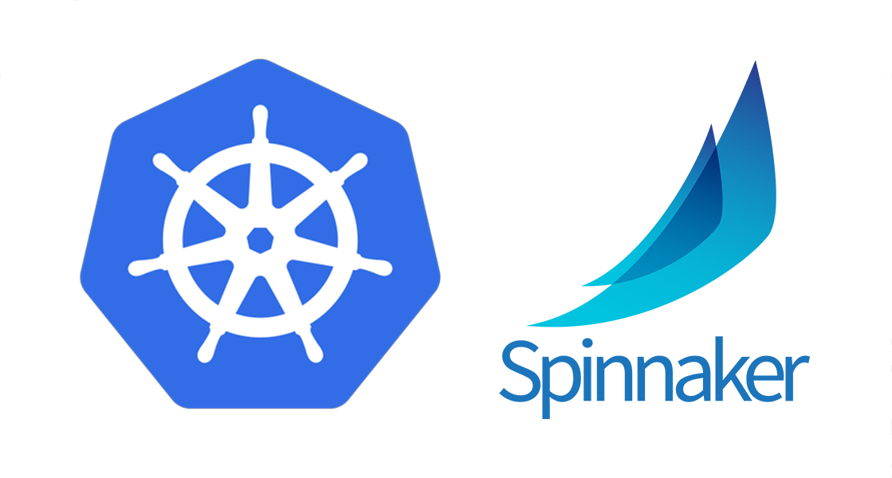

# Overview:

Scripts that you can use to access [Spinnaker](https://spinnaker.io/) that is running on [Kubernetes](https://kubernetes.io/) cluster.

MacOS scripts:
---------

In order for this scripts to work you need to have kubeconfig file exported:

    export KUBECONFIG=path/to/the/kubeconfig/file

If the file is located in a current directory use this:

    export KUBECONFIG=$PWD/kubeconfig

These files can be clicked on in the MacOS finder and will run in a terminal window.
They are interactive, and designed to be run independently.

To see the UI for Spinnaker on your desktop, run the *spinnaker_deck_pod_gui* and *spinnaker_gate_pod_gui* - then open address ***[localhost:9000](localhost:9000)*** in your browser.

To access the [Halyard](https://spinnaker.io/reference/halyard/) pod run the *spinnaker_halyard_shell_gui* - the name of the Spinnaker release is provided by the [Helm listing](https://github.com/helm/helm).
